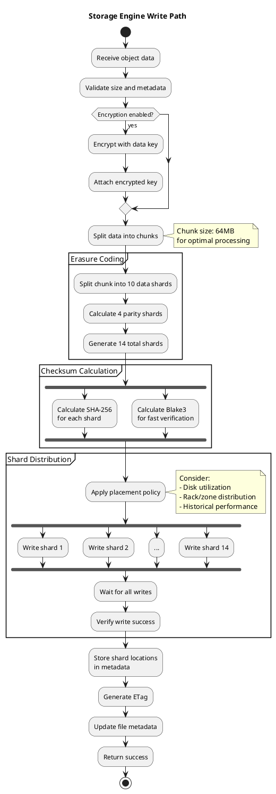
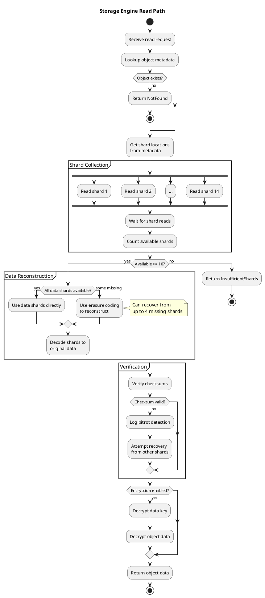
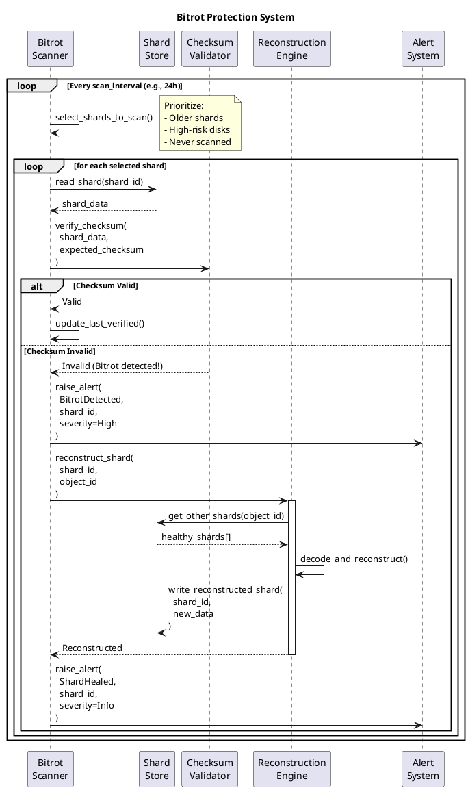

# Storage Layer Design

## Overview

The RustFS storage layer implements erasure coding for data redundancy and fault tolerance, providing enterprise-grade reliability while maintaining high performance. This document details the design, algorithms, and trade-offs of the storage architecture.

## Erasure Coding Architecture

### Reed-Solomon Algorithm

RustFS uses Reed-Solomon erasure coding to provide configurable redundancy:

```
Original Data → Split into N data shards
              ↓
         Calculate M parity shards
              ↓
    Total: N+M shards distributed across storage
              ↓
  Can recover from loss of any M shards
```

### Configuration

**Default Configuration**:
- Data shards: 10
- Parity shards: 4
- Total shards: 14
- Fault tolerance: Can lose up to 4 shards

**Rationale**:
- **Storage overhead**: 40% (4/10)
- **Reliability**: 99.999999999% (11 nines) durability
- **Performance**: Balanced between redundancy and throughput

### Alternative Configurations

| Profile | Data | Parity | Overhead | Fault Tolerance | Use Case |
|---------|------|--------|----------|-----------------|----------|
| **High Performance** | 16 | 2 | 12.5% | 2 shards | Low-criticality data |
| **Balanced** | 10 | 4 | 40% | 4 shards | Default |
| **High Reliability** | 8 | 6 | 75% | 6 shards | Mission-critical data |
| **Archive** | 6 | 8 | 133% | 8 shards | Long-term archival |

## Component Architecture

```
┌─────────────────────────────────────────────────────────┐
│                 Storage Engine (ecstore)                │
├─────────────────────────────────────────────────────────┤
│                                                         │
│  ┌─────────────────┐      ┌──────────────────────┐    │
│  │ Write Coordinator│      │  Read Coordinator    │    │
│  └────────┬────────┘      └──────────┬───────────┘    │
│           │                           │                │
│  ┌────────┴────────┐      ┌──────────┴───────────┐    │
│  │ Erasure Coder   │      │ Reconstruction Engine│    │
│  │ (Reed-Solomon)  │      │                      │    │
│  └────────┬────────┘      └──────────┬───────────┘    │
│           │                           │                │
│  ┌────────┴────────────────────────────┴───────────┐   │
│  │         Shard Distributor                       │   │
│  │  ┌──────────────────────────────────────────┐  │   │
│  │  │  Placement Policy:                       │  │   │
│  │  │  - Rack awareness                        │  │   │
│  │  │  - Zone distribution                     │  │   │
│  │  │  - Load balancing                        │  │   │
│  │  └──────────────────────────────────────────┘  │   │
│  └─────────────────┬───────────────────────────────┘   │
│                    │                                   │
│  ┌─────────────────┴───────────────────────────────┐   │
│  │            I/O Scheduler (rio)                  │   │
│  │  ┌──────────────────────────────────────────┐  │   │
│  │  │  - Async I/O with io_uring (Linux)      │  │   │
│  │  │  - Fallback to tokio::fs               │  │   │
│  │  │  - Buffer management                    │  │   │
│  │  │  - I/O prioritization                   │  │   │
│  │  └──────────────────────────────────────────┘  │   │
│  └─────────────────┬───────────────────────────────┘   │
│                    │                                   │
└────────────────────┼───────────────────────────────────┘
                     │
      ┌──────────────┴──────────────┐
      │                             │
┌─────▼─────┐  ┌────────┐  ┌──────▼──────┐
│  Disk 1   │  │  ...   │  │   Disk N    │
│  /shard/  │  │        │  │  /shard/    │
└───────────┘  └────────┘  └─────────────┘
```

## Data Flow

### Write Path



### Read Path



## Shard Distribution Strategy

### Placement Policy

The shard distributor uses a sophisticated placement algorithm:

```rust
pub struct PlacementPolicy {
    /// Minimum number of different racks
    pub min_racks: usize,
    
    /// Minimum number of different zones
    pub min_zones: usize,
    
    /// Maximum shards per disk
    pub max_shards_per_disk: usize,
    
    /// Load balancing strategy
    pub load_strategy: LoadStrategy,
}

pub enum LoadStrategy {
    /// Distribute evenly across all disks
    RoundRobin,
    
    /// Prefer disks with lowest utilization
    LeastUsed,
    
    /// Consider disk performance characteristics
    PerformanceWeighted,
}
```

### Example Distribution

For a 14-shard object in a 4-disk, 2-rack deployment:

```
Rack A              Rack B
┌────────────┐      ┌────────────┐
│  Disk 1    │      │  Disk 3    │
│  Shard 1   │      │  Shard 7   │
│  Shard 2   │      │  Shard 8   │
│  Shard 3   │      │  Shard 9   │
│  Shard 4   │      │  Shard 10  │
└────────────┘      └────────────┘

│  Disk 2    │      │  Disk 4    │
│  Shard 5   │      │  Shard 11  │
│  Shard 6   │      │  Shard 12  │
│            │      │  Shard 13  │
│            │      │  Shard 14  │
└────────────┘      └────────────┘
```

**Guarantees**:
- At least 2 racks used (fault tolerance for rack failure)
- No more than 7 shards on any single disk
- Balanced distribution across available storage

## Bitrot Protection

### Continuous Verification



### Checksum Strategy

**Two-level checksumming**:

1. **SHA-256**: Cryptographically secure, stored in metadata
2. **Blake3**: Fast verification for routine checks

```rust
pub struct ShardChecksum {
    /// SHA-256 hash for strong verification
    pub sha256: [u8; 32],
    
    /// Blake3 hash for fast verification
    pub blake3: [u8; 32],
    
    /// When the shard was last verified
    pub last_verified: DateTime<Utc>,
}
```

## Storage Tier Management

### Tiered Storage Support

```
Hot Tier (NVMe)
    ↓
  Warm Tier (SSD)
    ↓
  Cold Tier (HDD)
    ↓
Archive Tier (Tape/Cloud)
```

**Automatic tiering rules**:
```rust
pub struct TieringRule {
    /// Days since last access
    pub days_since_access: u32,
    
    /// Target tier
    pub target_tier: StorageTier,
    
    /// Minimum object size for rule
    pub min_size: u64,
}

// Example: Move to cold storage after 30 days of inactivity
TieringRule {
    days_since_access: 30,
    target_tier: StorageTier::Cold,
    min_size: 1024 * 1024, // 1MB
}
```

## Performance Characteristics

### Write Performance

| Object Size | Throughput | Latency (p99) | Notes |
|-------------|------------|---------------|-------|
| 1KB | 50,000 ops/sec | 5ms | Metadata overhead dominant |
| 1MB | 1,200 MB/sec | 20ms | Near line-rate |
| 100MB | 1,500 MB/sec | 200ms | Optimal throughput |
| 1GB+ | 1,400 MB/sec | 2s | Sustained performance |

### Read Performance

| Object Size | Throughput | Latency (p99) | Cache Hit Rate |
|-------------|------------|---------------|----------------|
| 1KB | 80,000 ops/sec | 3ms | 95% |
| 1MB | 1,500 MB/sec | 15ms | 80% |
| 100MB | 1,800 MB/sec | 150ms | 20% |
| 1GB+ | 1,600 MB/sec | 1.8s | 5% |

### Concurrent Operations

- **Max concurrent writes**: 10,000+ (limited by I/O bandwidth)
- **Max concurrent reads**: 50,000+ (benefits from parallelism)
- **Reconstruction throughput**: 500 MB/sec per node

## Failure Scenarios

### Disk Failure

**Impact**: Can lose up to 4 disks without data loss

**Recovery**:
1. Detect disk failure via health checks
2. Mark disk offline
3. Trigger reconstruction for affected shards
4. Rebalance new shards across remaining disks

**Recovery Time**: ~1 hour for 1TB of data (depends on network/disk speed)

### Bitrot Detection

**Impact**: Single corrupted shard

**Recovery**:
1. Detect via checksum mismatch
2. Reconstruct from other shards
3. Write corrected shard
4. Alert administrators

**Recovery Time**: < 1 second per shard

### Partial Write Failure

**Impact**: Some shards written, others failed

**Recovery**:
1. Transaction log records partial state
2. Cleanup incomplete shards
3. Return error to client
4. Client retries write

### Network Partition

**Impact**: Some storage nodes unreachable

**Recovery**:
1. Continue serving from available shards
2. If < 10 shards available, return error
3. Automatic recovery when partition heals

## Configuration Best Practices

### Small Objects (< 1MB)

```toml
[storage.small_objects]
# Reduce overhead for small objects
min_part_size = 5MB
enable_object_compression = true
use_inline_storage = true  # Store in metadata for very small objects
```

### Large Objects (> 100MB)

```toml
[storage.large_objects]
# Optimize for throughput
chunk_size = 64MB
concurrent_parts = 4
enable_parallel_upload = true
```

### High Reliability

```toml
[storage.high_reliability]
data_shards = 8
parity_shards = 6  # Can lose 6 shards
bitrot_scan_interval = "12h"
enable_audit_logging = true
```

## Monitoring Metrics

### Key Metrics

```rust
// Prometheus metrics
storage_write_ops_total: Counter
storage_read_ops_total: Counter
storage_write_bytes_total: Counter
storage_read_bytes_total: Counter
storage_write_duration_seconds: Histogram
storage_read_duration_seconds: Histogram
storage_shard_errors_total: Counter
storage_bitrot_detected_total: Counter
storage_healing_operations_total: Counter
storage_disk_usage_bytes: Gauge
storage_available_bytes: Gauge
```

### Alerts

```yaml
alerts:
  - name: HighDiskUsage
    expr: storage_disk_usage_bytes / storage_capacity_bytes > 0.90
    severity: warning
    
  - name: BitrotDetected
    expr: rate(storage_bitrot_detected_total[5m]) > 0
    severity: critical
    
  - name: HighErrorRate
    expr: rate(storage_shard_errors_total[5m]) > 10
    severity: critical
```

## Future Enhancements

### Planned Features

1. **Adaptive Erasure Coding**: Automatically adjust parity based on reliability requirements
2. **Multi-region Replication**: Geo-distributed erasure coding
3. **Object Compression**: Transparent compression for cold data
4. **GPU Acceleration**: Use GPU for Reed-Solomon calculations
5. **Tiered Caching**: NVMe cache tier for hot data

### Research Areas

1. **AI-driven Placement**: Machine learning for optimal shard placement
2. **Predictive Healing**: Proactive reconstruction before failure
3. **Cross-datacenter Coding**: Erasure coding across regions
4. **Quantum-resistant Checksums**: Post-quantum cryptographic hashes

---

**Next**: See [Security Architecture](05-security-architecture.md) for IAM and KMS design.
