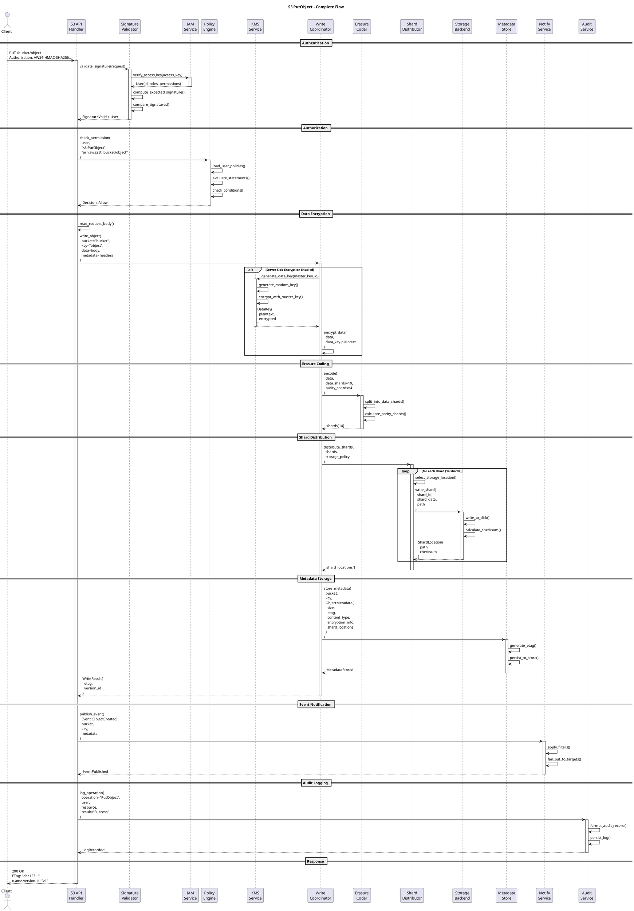
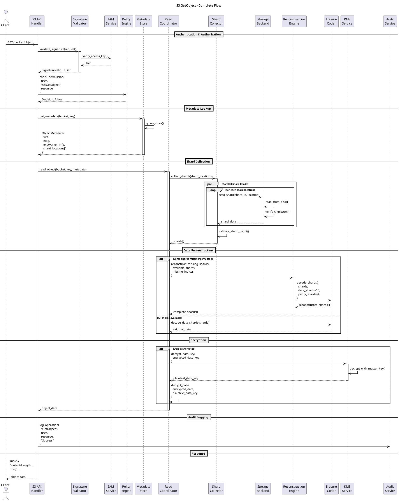
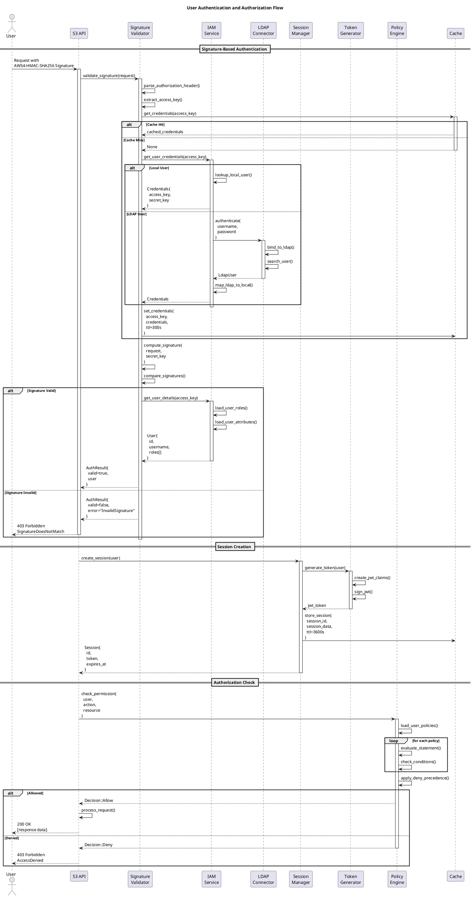
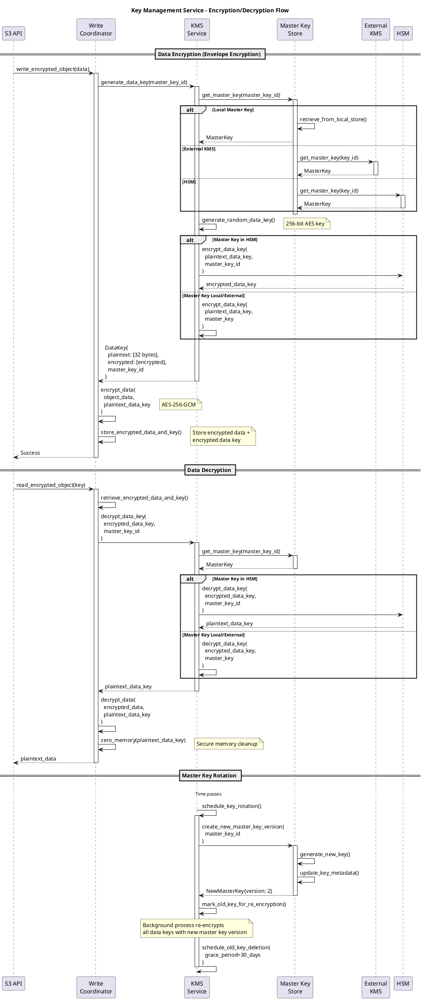
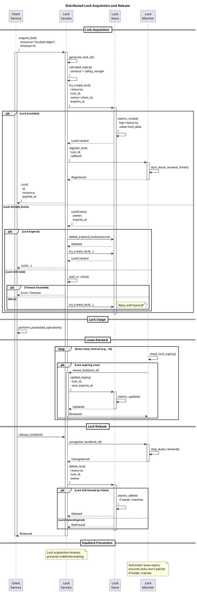

# Sequence Diagrams

## Introduction

This document contains sequence diagrams for critical workflows in RustFS, illustrating the interactions between components during key operations.

## 1. Object Upload (PutObject)



## 2. Object Download (GetObject)



## 3. User Authentication Flow



## 4. Multipart Upload Flow

```plantuml
@startuml Multipart_Upload
title S3 Multipart Upload Flow

actor Client
participant "S3 API" as API
participant "Multipart\nHandler" as MPH
participant "Metadata\nStore" as META
participant "Temp\nStorage" as TEMP
participant "Write\nCoordinator" as WRITE
participant "Storage\nEngine" as STORAGE

== Initiate Multipart Upload ==
Client -> API: POST /bucket/object?uploads
activate API

API -> MPH: initiate_multipart_upload(\n  bucket,\n  key,\n  metadata\n)
activate MPH

MPH -> MPH: generate_upload_id()
MPH -> META: store_upload_metadata(\n  upload_id,\n  bucket,\n  key,\n  metadata\n)
activate META
META --> MPH: Stored
deactivate META

MPH --> API: UploadId
API --> Client: 200 OK\nUploadId: "abc123..."
deactivate MPH
deactivate API

== Upload Parts (concurrent) ==
par Part 1
    Client -> API: PUT /bucket/object?\n  uploadId=abc123&partNumber=1
    activate API
    API -> MPH: upload_part(upload_id, 1, data)
    activate MPH
    MPH -> TEMP: store_part(upload_id, 1, data)
    activate TEMP
    TEMP -> TEMP: calculate_etag()
    TEMP --> MPH: PartETag
    deactivate TEMP
    MPH -> META: record_part(upload_id, 1, etag)
    MPH --> API: PartETag
    deactivate MPH
    API --> Client: 200 OK\nETag: "part1-etag"
    deactivate API
and Part 2
    Client -> API: PUT /bucket/object?\n  uploadId=abc123&partNumber=2
    activate API
    API -> MPH: upload_part(upload_id, 2, data)
    activate MPH
    MPH -> TEMP: store_part(upload_id, 2, data)
    activate TEMP
    TEMP --> MPH: PartETag
    deactivate TEMP
    MPH -> META: record_part(upload_id, 2, etag)
    MPH --> API: PartETag
    deactivate MPH
    API --> Client: 200 OK\nETag: "part2-etag"
    deactivate API
and Part N
    Client -> API: PUT /bucket/object?\n  uploadId=abc123&partNumber=N
    activate API
    API -> MPH: upload_part(upload_id, N, data)
    activate MPH
    MPH -> TEMP: store_part(upload_id, N, data)
    activate TEMP
    TEMP --> MPH: PartETag
    deactivate TEMP
    MPH -> META: record_part(upload_id, N, etag)
    MPH --> API: PartETag
    deactivate MPH
    API --> Client: 200 OK\nETag: "partN-etag"
    deactivate API
end

== Complete Multipart Upload ==
Client -> API: POST /bucket/object?\n  uploadId=abc123\n<CompleteMultipartUpload>
activate API

API -> MPH: complete_multipart_upload(\n  upload_id,\n  parts[]\n)
activate MPH

MPH -> META: get_upload_parts(upload_id)
activate META
META --> MPH: parts[]
deactivate META

MPH -> MPH: validate_parts_sequence()
MPH -> MPH: validate_part_etags()

loop for each part
    MPH -> TEMP: read_part(upload_id, part_num)
    activate TEMP
    TEMP --> MPH: part_data
    deactivate TEMP
end

MPH -> MPH: concatenate_parts()

MPH -> WRITE: write_object(\n  bucket,\n  key,\n  concatenated_data,\n  metadata\n)
activate WRITE
WRITE -> STORAGE: store_with_erasure_coding()
WRITE --> MPH: ObjectInfo
deactivate WRITE

MPH -> TEMP: cleanup_parts(upload_id)
MPH -> META: delete_upload_metadata(upload_id)

MPH --> API: CompleteResult{\n  location,\n  bucket,\n  key,\n  etag\n}
deactivate MPH

API --> Client: 200 OK\n<CompleteMultipartUploadResult>\n  <ETag>final-etag</ETag>\n</CompleteMultipartUploadResult>
deactivate API

@enduml
```

## 5. Key Management Service Flow



## 6. Distributed Lock Acquisition



## Summary

These sequence diagrams illustrate the key workflows in RustFS:

1. **Object Upload**: Complete flow from authentication to storage
2. **Object Download**: Shard collection, reconstruction, and decryption
3. **Authentication**: Signature validation and session management
4. **Multipart Upload**: Concurrent part uploads and assembly
5. **Key Management**: Envelope encryption and key rotation
6. **Distributed Locking**: Coordination and deadlock prevention

Each diagram shows the interaction between components and the flow of control through the system.

---

**Next**: See [Data Flow Diagrams](07-data-flow.md) for data movement patterns.
